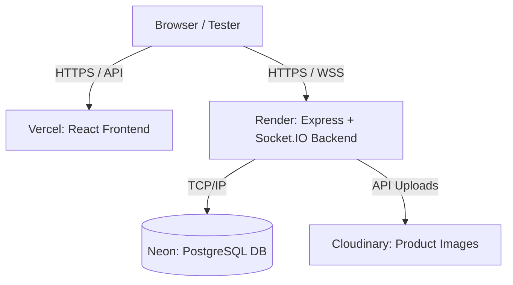

# Deployment Planning — Architecture Review & Temporary UAT Recommendation

## 1. Current Architecture Summary
Based on the direct inspection of the codebase, the RANGRASIYA application uses the following stack:
*   **Frontend**: A unified React SPA built with Vite (serves both Customer Storefront and Owner Panel based on routing). It uses `react-router-dom` and native `fetch` for API calls.
*   **Backend**: Node.js + Express.
*   **Database**: PostgreSQL, interfaced natively via the `pg` package connection pool.
*   **Authentication**: JWT-based, maintaining strict role separation between Customer tokens and Owner tokens.
*   **Real-time**: Socket.IO is actively integrated and configured to enforce strict WebSockets (`transports: ["websocket"]`) to broadcast live inventory changes to connected clients.
*   **File Storage**: Product images are uploaded via `multer` using `diskStorage`, writing binary files directly to the local filesystem at `server/uploads/`.

## 2. Components Requiring Deployment
To make the application fully functional over the internet, we must deploy **four** distinct runtime components:
1.  **Frontend Application:** One unified deployment handles both Customer and Owner interfaces.
2.  **Express Backend API:** Requires a persistent runtime capable of running the Node server.
3.  **Database:** A managed PostgreSQL instance.
4.  **Persistent Object Storage:** A remote location to store uploaded product images (to replace local disk storage).

## 3. Vercel Analysis
*   **Frontend on Vercel:** **Perfect Fit.** Vercel natively supports Vite React SPAs. It will serve the static bundle blazingly fast globally with zero configuration.
*   **Backend on Vercel:** **Not Recommended.** Deploying an existing, heavily-routed Express application to Vercel requires converting it into Serverless Functions. This introduces massive limitations:
    *   **Ephemeral Disk:** Vercel serverless instances are read-only. Local Multer uploads would instantly fail or disappear.
    *   **No WebSockets:** Vercel standard serverless functions explicitly do not support long-lived WebSocket connections. Our Socket.IO implementation would completely break.
*   **Conclusion:** Vercel should absolutely be used, but **strictly for the frontend**. The backend must be deployed elsewhere.

## 4. Free Hosting Comparison
*   **FRONTEND:**
    *   *Vercel (Free Tier):* Best-in-class for Vite/React. Seamless GitHub integration.
    *   *Cloudflare Pages / Netlify:* Excellent alternatives, but Vercel is the industry standard for this exact stack.
*   **BACKEND:**
    *   *Render (Free Tier):* Excellent for standard Express apps. Native WebSocket support. **Limitation:** Spins down after 15 minutes of inactivity, causing ~30-second cold starts. Disk is ephemeral.
    *   *Fly.io (Hobby Tier):* Generous (3 shared VMs). Supports persistent volumes. **Limitation:** Requires Dockerfiles, command-line deployment (`flyctl`), and frequently requires a credit card to activate the free tier.
    *   *Koyeb / Railway:* Koyeb is good but restrictive; Railway has deprecated its free tier.
*   **DATABASE:**
    *   *Neon (Free Tier):* True serverless Postgres. 500MB free. Excellent dashboard and connection pooling. **Limitation:** Sleeps on inactivity, but wake-up is extremely fast (< 2s) and handled gracefully.
    *   *Supabase (Free Tier):* 500MB free database. Doesn't sleep daily, but pauses if unused for 7 days.
    *   *Render Postgres (Free Tier):* Good, but the database is permanently deleted after 30 days (risky if UAT gets extended).
*   **IMAGE STORAGE:**
    *   *Cloudinary (Free Tier):* Highly generous free tier. Excellent Node SDK. Requires minor code changes.
    *   *Supabase Storage:* Good alternative, but Cloudinary's direct integration with Multer (`multer-storage-cloudinary`) is much simpler for Express.

## 5. Recommended Frontend Host
**Vercel.** It provides automated deployments from GitHub, free SSL, and a custom `*.vercel.app` URL immediately. 

## 6. Recommended Backend Host
**Render (Web Service Free Tier).** It natively supports Node.js, Express, and WebSockets without requiring a Dockerfile. The 15-minute sleep behavior is perfectly acceptable for a 10-day UAT period.

## 7. Recommended PostgreSQL Provider
**Neon.** It is the most robust serverless Postgres provider, requires no credit card for the free tier, and provides a standard Postgres connection string that plugs directly into our existing `pg` pool.

## 8. Recommended Image Storage
**Cloudinary.** Because Render's free tier has an ephemeral disk (uploads are wiped when the server restarts/sleeps), we cannot rely on local `server/uploads/`. Cloudinary seamlessly replaces local disk storage via `multer-storage-cloudinary`.

## 9. Socket.IO Analysis
Our inspection reveals Socket.IO is actively used (`client/src/hooks/useSocket.js`) to broadcast `inventory:updated` events to the Owner Panel. The frontend explicitly requests the `"websocket"` transport. 
Because we are selecting Render to host the backend, WebSockets are fully supported. Socket.IO will continue to function exactly as designed without any architectural modifications.

## 10. Temporary UAT Architecture Diagram

## 11. Future Production Architecture
When moving out of UAT into production, the architecture remains conceptually identical, but the tiers change:
*   **Frontend:** Vercel (Pro tier if traffic demands, or stay Free if under limits).
*   **Backend:** Render (Paid Tier - $7/mo) to prevent sleeping and cold starts.
*   **Database:** Neon (Paid Tier) or AWS RDS for daily automated backups and higher storage limits.
*   **Storage:** Cloudinary (Paid) or AWS S3.

## 12. Security/Environment Configuration
**No secrets should be committed to GitHub.**
*   **Frontend (Vercel):**
    *   `VITE_BACKEND_URL` = `https://rangrasiya-api.onrender.com`
*   **Backend (Render):**
    *   `PORT` = `10000` (Render's default)
    *   `FRONTEND_URL` = `https://rangrasiya.vercel.app` (used for strict CORS configuration)
    *   `DATABASE_URL` = `<Neon Connection String>`
    *   `JWT_SECRET` = `<Secure Random String>`
    *   `OWNER_PASSWORD` = `<Secure Password>`
    *   `CLOUDINARY_URL` = `<Cloudinary Secret URL>`

## 13. Database Migration Strategy
We will NOT clone or expose the 605-product local development database to the UAT environment. 
**Safest Strategy:**
1. Connect the local backend to the remote Neon DB temporarily and run the `001` through `009` migration files to initialize a pristine, empty schema.
2. The UAT database will start 100% clean.

## 14. 30–50 Product UAT Strategy
Instead of blindly importing data, we will write a strict, temporary Node.js script locally. This script will connect to the local DB, `SELECT` exactly 30 representative products (and their associated categories/variants/images), and `INSERT` them directly into the remote Neon connection. This guarantees no development garbage leaks into UAT.

## 15. Cost Comparison

| Provider | Component | Free Option | Main Limitation | 10-day UAT? | Prod? | Recommended |
| :--- | :--- | :--- | :--- | :--- | :--- | :--- |
| **Vercel** | Frontend | Yes | Bandwidth limits (generous) | ✅ YES | ✅ YES | ✅ Primary |
| **Render** | Backend | Yes | Sleeps after 15m (cold starts) | ✅ YES | ❌ NO | ✅ Primary |
| **Fly.io** | Backend | Yes | Docker required, CC sometimes req. | ✅ YES | ✅ YES | ⚠️ Backup |
| **Neon** | Database | Yes | Sleeps, 500MB max | ✅ YES | ✅ YES | ✅ Primary |
| **Supabase** | Database | Yes | Pauses after 7 days inactive | ✅ YES | ✅ YES | ⚠️ Backup |
| **Cloudinary** | Images | Yes | 25 Credits/mo | ✅ YES | ✅ YES | ✅ Primary |

## 16. Primary Recommendation
*   **Frontend:** Vercel
*   **Backend:** Render
*   **Database:** Neon
*   **Image Storage:** Cloudinary
*   **Domain:** Provider defaults (`.vercel.app`, `.onrender.com`)
*   **Socket.IO:** Supported natively via Render
*   **Reason:** This stack perfectly balances absolute zero cost, reliable infrastructure, and minimum friction. It strictly preserves the existing Express+Websocket architecture.
*   **Estimated Temporary Cost:** $0.00
*   **Expected Setup Complexity:** LOW

## 17. Backup Recommendation
If Render's 30-second cold start is deemed unacceptable by the Owner even for UAT:
*   **Frontend:** Vercel
*   **Backend:** Fly.io (Provides free VMs that do not sleep, but requires command-line deployment and Docker configuration).
*   **Database:** Supabase Postgres.
*   **Storage:** Cloudinary.

## 18. Exact Deployment Steps
*   **STEP 1:** Register free accounts on Vercel, Render, Neon, and Cloudinary.
*   **STEP 2:** Retrieve Neon DB credentials. Update local `database.js` to support SSL if deployed. Run migrations against the remote Neon DB to create tables.
*   **STEP 3:** Run local Node script to carefully seed ~30 selected products from local DB to Neon DB.
*   **STEP 4:** Implement Cloudinary in `server/src/middleware/upload.js`.
*   **STEP 5:** Push codebase to a private GitHub repository.
*   **STEP 6:** Connect Render to GitHub, deploy Backend. Configure Render Environment Variables (`DATABASE_URL`, `JWT_SECRET`, etc.).
*   **STEP 7:** Connect Vercel to GitHub, deploy Frontend. Configure Vercel Environment Variables (`VITE_BACKEND_URL`).
*   **STEP 8:** Update Render `FRONTEND_URL` to match the exact Vercel deployment URL to finalize strict CORS security.
*   **STEP 9:** Smoke test Customer portal (Cart, Registration, Checkout).
*   **STEP 10:** Smoke test Owner portal (WebSockets, Product Image Uploading via Cloudinary).
*   **STEP 11:** Final UAT readiness check. Hand over URLs and `OWNER_PASSWORD` to the client.

## 19. Required Code/Config Changes
To achieve this, we strongly prioritize minimal modifications:

**NO CODE CHANGE**
*   React routing, UI, and business logic.
*   Socket.IO implementation on frontend and backend.
*   Authentication flows.

**CONFIGURATION ONLY**
*   CORS origin string.
*   Frontend API endpoint strings.

**SMALL CODE CHANGE**
1.  **Image Uploads:** We must change `multer.diskStorage` to `multer-storage-cloudinary` in `server/src/middleware/upload.js`. This is unavoidable because free platforms have ephemeral disks.
2.  **Database Connection:** We must update `server/src/config/database.js` to accept a unified `DATABASE_URL` string and configure SSL (`rejectUnauthorized: false`), which is required by managed cloud databases like Neon.

## 20. Risks and Limitations
*   **Render Cold Starts:** The backend will go to sleep if nobody visits the site for 15 minutes. The very first request after sleeping (e.g., loading the storefront or logging in) may take 20–30 seconds. All subsequent requests will be instantaneous. The Owner must be informed of this to avoid reporting it as a "crash".
*   **Ephemeral Logs:** Render free tier does not persist server logs indefinitely.

## 21. Final Recommendation
We strongly recommend the **Vercel + Render + Neon + Cloudinary** architecture. It is 100% free, highly professional, perfectly suites a 10-day UAT period, requires almost zero architectural rewrites, and scales identically into a paid production tier when the client is ready.

---
**READY TO BEGIN DEPLOYMENT**
